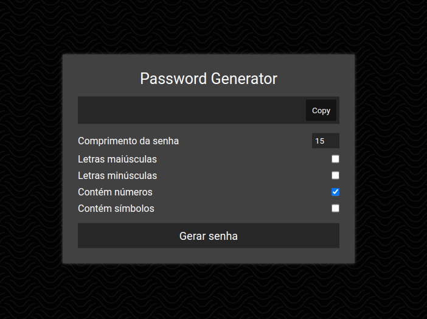

<h1 align="center">Password Generator</h1>

  

Aplicação desenvolvida com JavaScript vanilla.

O app permite criar uma senha aleatória com algumas opções, como: comprimento da senha, letras maiúsculas, letras minúsculas, incluir números e incluir caracteres especiais.

